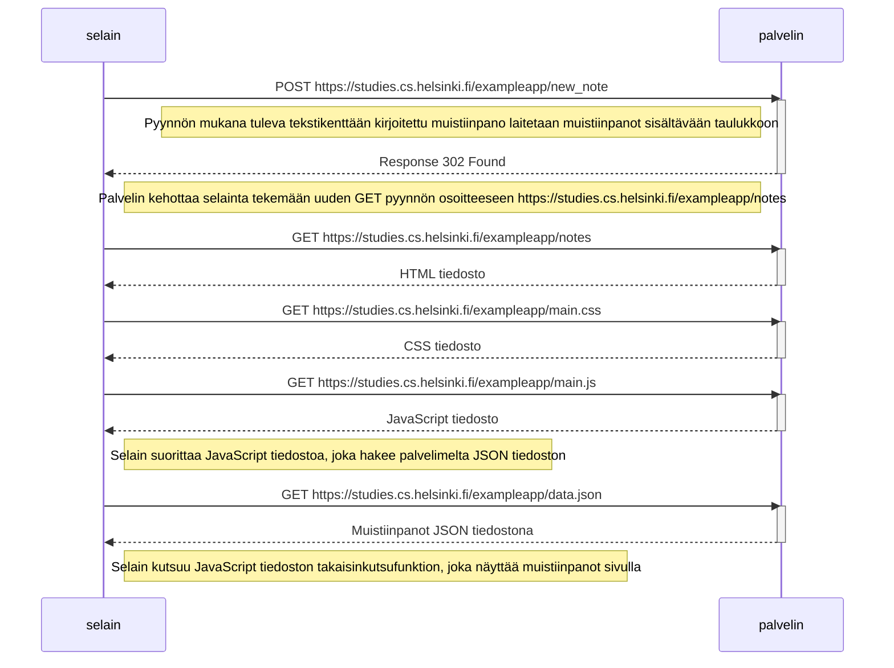

```mermaid
sequenceDiagram
    participant selain
    participant palvelin

    selain->>palvelin: POST https://studies.cs.helsinki.fi/exampleapp/new_note
    activate palvelin
    Note left of palvelin: Pyynnön mukana tuleva tekstikenttään kirjoitettu muistiinpano laitetaan muistiinpanot sisältävään taulukkoon
    palvelin-->>selain: Response 302 Found
    deactivate palvelin
    Note left of palvelin: Palvelin kehottaa selainta tekemään uuden GET pyynnön osoitteeseen https://studies.cs.helsinki.fi/exampleapp/notes
    
    selain->>palvelin: GET https://studies.cs.helsinki.fi/exampleapp/notes
    activate palvelin
    palvelin-->>selain: HTML tiedosto
    deactivate palvelin

    selain->>palvelin: GET https://studies.cs.helsinki.fi/exampleapp/main.css
    activate palvelin
    palvelin-->>selain: CSS tiedosto
    deactivate palvelin

    selain->>palvelin: GET https://studies.cs.helsinki.fi/exampleapp/main.js
    activate palvelin
    palvelin-->>selain: JavaScript tiedosto
    deactivate palvelin
    Note right of selain: Selain suorittaa JavaScript tiedostoa, joka hakee palvelimelta JSON tiedoston

    selain->>palvelin: GET https://studies.cs.helsinki.fi/exampleapp/data.json
    activate palvelin
    palvelin-->>selain: Muistiinpanot JSON tiedostona
    deactivate palvelin
    Note right of selain: Selain kutsuu JavaScript tiedoston takaisinkutsufunktion, joka näyttää muistiinpanot sivulla
```