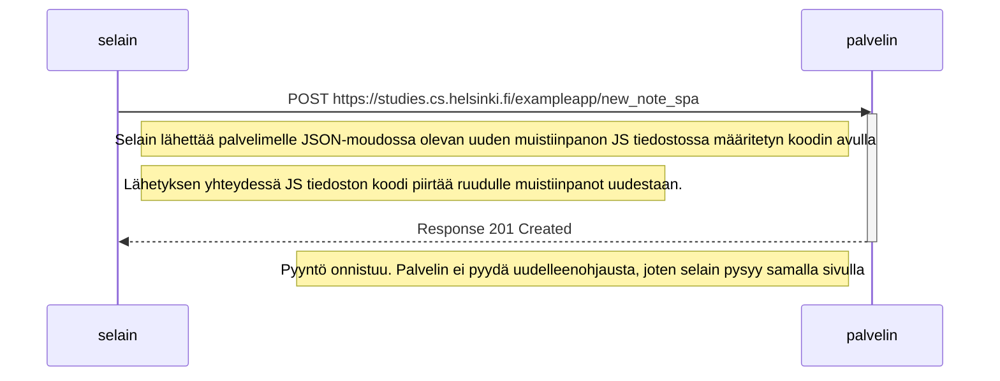

```mermaid
sequenceDiagram
    participant selain
    participant palvelin

    selain->>palvelin: POST https://studies.cs.helsinki.fi/exampleapp/new_note_spa
    activate palvelin
    note right of selain: Selain lähettää palvelimelle JSON-moudossa olevan uuden muistiinpanon JS tiedostossa määritetyn koodin avulla
    note right of selain: Lähetyksen yhteydessä JS tiedoston koodi piirtää ruudulle muistiinpanot uudestaan.
    palvelin-->>selain: Response 201 Created
    deactivate palvelin
    note left of palvelin: Pyyntö onnistuu. Palvelin ei pyydä uudelleenohjausta, joten selain pysyy samalla sivulla
```